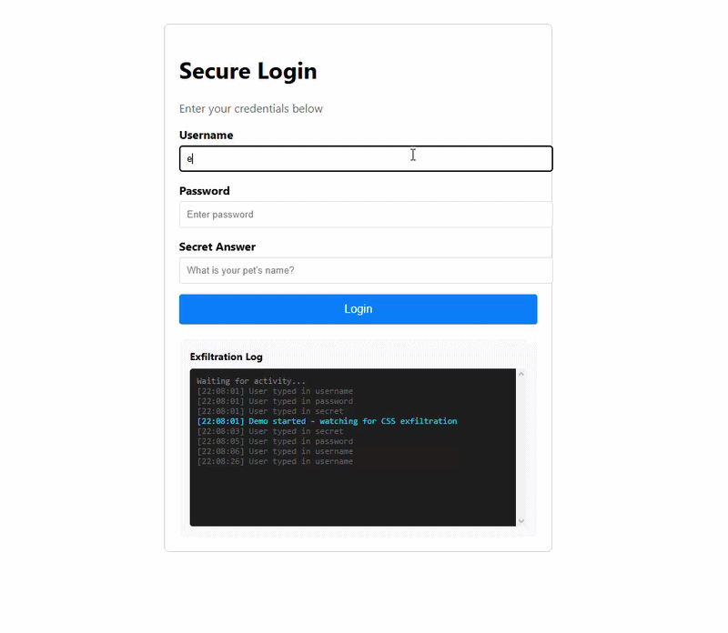

# CSS Cache Thief

Proof of concept showing how CSS can steal form data.



## What it does

Uses CSS attribute selectors to match input values and trigger background-image requests. Every character you type in a form field generates a request that reveals the character. No JavaScript needed for the exfiltration itself.

The demo shows five attack vectors:

- Character keylogging via input[value*="x"]
- Password field detection using :has()
- CSRF token theft from meta tags
- Focus tracking on form fields
- Form submission detection

## How to run

Open index.html in any browser. Type in the form fields and watch the log panel fill with stolen data.

## Why this matters

This attack works even with script-src: 'none' CSP policies. Most security tools miss it because they only look for script-based attacks. The fix is to restrict style-src and avoid using background-image on form elements.

## Mitigations

- Set Content-Security-Policy: style-src 'self'
- Don't use background-image on inputs or form elements
- Sanitize any CSS from untrusted sources
- Use sandbox attributes on iframes

## How it works

The browser makes HTTP requests for background images. Each request includes the matched character in the URL parameters. A remote server can reconstruct the full input value from the request sequence.

The :has() selector detects parent elements containing specific child patterns. This lets the attack identify password fields and forms.

## Server setup

If you want to run the attacker server:

```bash
npm install
npm start
